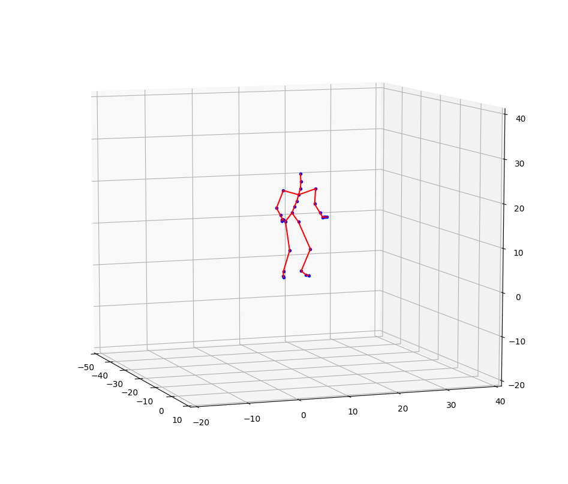

# MoCapParser

A lightweight library to parse and visualize asf/amc files from [CMU MoCap](http://mocap.cs.cmu.edu/) dataset using Python 3.

The main purpose of this library is to help understanding how asf/amc file works, as well as how to use them. Therefore, simplicity and readability are stressed, while robustness is ignored.

## Demo



## Usage

There's a simple example in the source code as follows:

```python
if __name__ == '__main__':
  asf_path = './data/01/01.asf'
  amc_path = './data/01/01_01.amc'
  joints = parse_asf(asf_path)
  motions = parse_amc(amc_path)
  frame_idx = 180
  joints['root'].set_motion(motions[180])
  joints['root'].draw()
```

The data can be found from CMU MoCap dataset.

## Parser

The asf/amc parsers are straightforward and easy to understand. The parsers are fully tested on the CMU MoCap dataset, but I don't expect it can work on other datasets without any modification. However, it won't be hard to extend it for more complicating asf/amc files.

## Visualization

Matplotlib is used to draw joints and bones in 3D, because using OpenGL or other rendering tools would be too 'heavy'. The drawback is that it can only draw one frame at a time, and animation is not supported. Anyway, that would be enough for a simple glimpse of the motion.

## Dependencies

* numpy
* transforms3d
* matplotlib

All the dependencies are available via `pip install`.

## One More Thing

If this repo is used in any publications or projects, please let me know. I would be happy and encouraged =)
